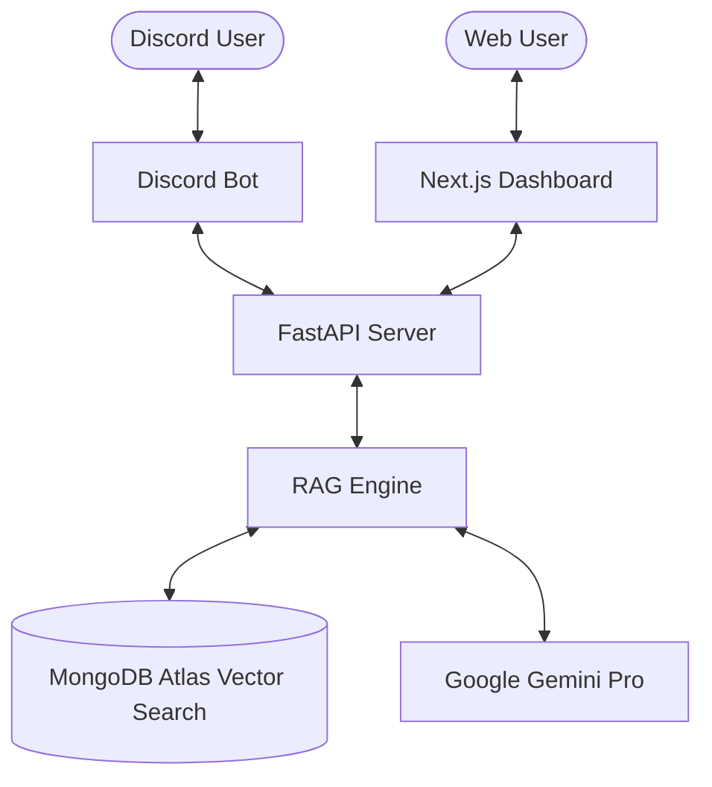

# 🤖 Discord RAG Chatbot

[](https://fastapi.tiangolo.com/)
[](https://discordpy.readthedocs.io/)
[](https://www.mongodb.com/)
[](https://nextjs.org/)

A professional-grade Discord Chatbot powered by **Retrieval-Augmented Generation (RAG)**. This bot leverages a custom knowledge base (PDFs, Docs) to provide accurate, context-aware answers directly in your Discord server.

## 🌟 Features

- **Context-Aware Responses**: Uses RAG to retrieve information from uploaded documents before generating answers.
- **Dual Interface**: Interact via Discord commands or a sleek Next.js Web Dashboard.
- **Vector Search**: High-performance similarity search using MongoDB Atlas Vector Search.
- **Feedback Loop**: Integrated 👍/👎 reaction tracking for continuous improvement.
- **Real-time API**: Scalable FastAPI backend serving both Discord and Web clients.

## 🏗️ Architecture



## 🚀 Quick Start

### 1. Prerequisites
- Python 3.9+
- Node.js 18+
- MongoDB Atlas Cluster (with Vector Search enabled)

### 2. Setup Environment
Clone the repository and create a `.env` file based on `.env.example`:
```bash
DISCORD_TOKEN=your_token
GOOGLE_API_KEY=your_key
MONGODB_URI=your_mongodb_uri
DATABASE_NAME=discord_rag_bot
COLLECTION_NAME=knowledge_base
VECTOR_INDEX_NAME=vector_index
```

### 3. Install Dependencies
```bash
# Install Python dependencies
pip install -r requirements.txt

# Install Frontend dependencies
cd frontend
npm install
```

### 4. Run the Project
You can use the helper script:
```bash
python setup_and_run.py
```

## 🛠️ Tech Stack

- **Backend**: Python, FastAPI, LlamaIndex / LangChain
- **Frontend**: Next.js, TypeScript, Tailwind CSS
- **Database**: MongoDB Atlas (Vector Store)
- **AI Model**: Google Gemini Pro
- **Bot Framework**: Discord.py

## 📸 Screenshots

*Coming Soon...*

---

Developed with ❤️ for AI Engineering Course.
